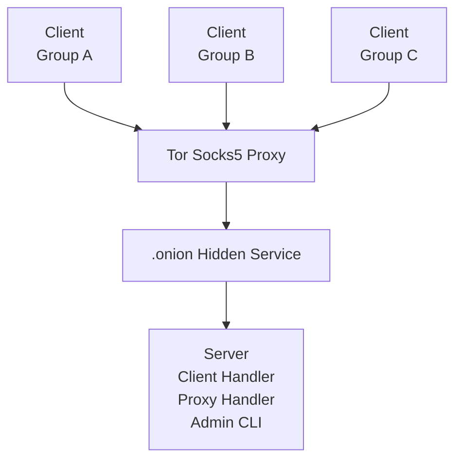

# Tor Connect
A lightweight client and server system that maintains persistent connections to a hidden service through Tor Socks5 proxies and distributes proxy updates to connected clients.
The server manages connected clients, periodically checks available Tor proxies, and pushes updated proxy lists to clients.
Clients maintain a connection to the server through Tor and automatically update their proxy pool when new proxies are received.

## Architecture

## Components

### Server (Go)

The server handles:

- Client connections
- Proxy distribution
- Tor proxy validation
- Admin CLI

### Client (Zig)

The client handles:

- Maintaining a connection to the server
- Updating proxies when the server sends them

## Protocol
```
+------------+--------+--------+
| Body Size  | Type   | Body   |
| 2 byte     | 1 byte | N byte |
+------------+--------+--------+
```
**Data Types:**
| Type  | Description    |
| ----- | -------------- |
| 0     | Handshake      |
| 1     | KeepAlive      |
| 2     | Proxy Lists    |

**Handshake:**
```
Client => Server

Type: 0
Body: groupA
```
```
Client <= Server

Type: 0
Body: ok
```

**KeepAlive:**
```
Client => Server

Type: 1
Body: 0
```
```
Client <= Server

Type: 1
Body: ok
```

**Proxy Lists:**
```
Server => Client

Type: 2
Body: proxy1 proxy2 proxy3
```

## Configuration
```json
{
    "client": {
        "listen_addr": "127.0.0.1:2222",
        "proxy": {
            "proxies_path": "proxies.txt",
            "sender_delay": 10,
            "checker": true
        }
    }
}
```
`listen_addr`: server listen address   
`proxies_path`:	proxy list file   
`sender_delay`:	proxy broadcast interval   
`checker`: enable Tor proxy verification   
